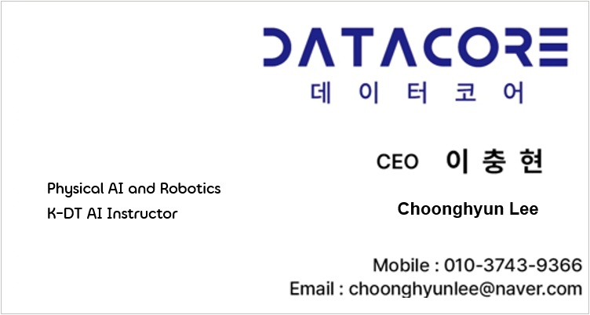

# 안녕하세요, 이충현(VICTOR)입니다 👋

**Physical AI · Robotics · Technical Education**

반도체, 디스플레이, 자동차, 물류 산업에서 시스템 & 소프트웨어 개발, 프로젝트·컨설팅을 수행했습니다.
현재는 데이터코어 대표로서 협동로봇, ROS2, 컴퓨터 비전, 센서, 음성 인식 기술을 연결하는 Physical AI 프로젝트와 기술 교육에 집중하고 있습니다.

대학생과 실무자를 대상으로 로봇·AI 프로젝트를 지도합니다.
문제 정의부터 시스템 구현과 검증, 예외 상황 대응까지 직접 경험하며 현장에서 활용할 수 있는 역량을 갖추도록 돕고 있습니다.
협동로봇과 AI 기술을 연결하고, 학생들이 현장에서 작동하는 AI·로봇 시스템을 직접 만들도록 가르치고 있습니다.

## 강의 분야
- Physical AI and VLM/VLA
- ROS(Robot Operating System)
- Computer Vision
- 음성 명령과 객체 인식을 활용한 로봇 프로젝트
- 로봇·AI 기술 교육 및 프로젝트 멘토링
- Python, Embedded(C/C++), Java, Database
- AX & DX, Digital Twin, Smart Logistics and Smart Factory

### 📚 주요 프로젝트

- **반도체 공정 실시간 모니터링**
- **디스플레이 자동화 공정 프로젝트(Cognex Computer Vision, Robot, AMR, Servo, PLC)**
- **자동차 공정 및 R&D 장비 예지보전 시스템**
- **메가허브 물류센터 예지보전 시스템**

---

### 📇 명함

  
  

- 💼 직업훈련교사 자격증
  - **인공지능**
  - **디지털트윈**
  - **스마트물류**
  - **스마트공장**
  - **정보기술개발**
  - **정보기술전략·계획**
  - **정보기술운영·관리**
  - **전자기기개발**
  - **사업관리**

- 🤖 Credentials
  - 중소벤처기업부 K Startup 창업사업 평가위원
  - AI훈련코치(한국산업인력공단 중소기업AI훈련확산센터)
  - 정보통신산업진흥원(NIPA) 평가위원
  - 정보통신기획평가원(IITP) 평가위원
  - 스마트공장 수준확인 심사원(한국 표준협회)
  - 경기도 기술개발사업 평가위원
  - 데이터분석준전문가(ADsP)

<strong>현재 경력</strong>

| 경력 | 기간 |
| --- | --- |
| 데이터코어 대표 | 2023년 ~ 현재 |
| 대한상공회의소 디지털 선도기업 아카데미 두산로보틱스 지능형 AI·로보틱스 ROKEY Boot Camp Tutor | 2024년 7월 ~ 현재 |
| 한국기술교육대학교 능력개발교육원 보수교육 AI 교육과정 개발자 | 2026년 9월 ~ 현재 |
| 대한상공회의소 서울기술교육센터 AI·로봇 안전제어 솔루션 멘토 | 2026년 7월 ~ 현재 |
| 한국산업인력공단 중소기업AI훈련확산센터 AI 훈련코치 | 2026년 4월 ~ 현재 |

