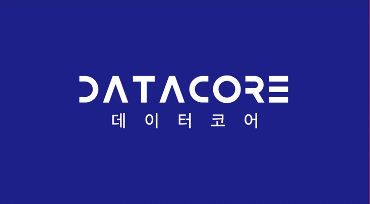

# 안녕하세요, 이충현(VICTOR)입니다 👋

**Physical AI · Robotics · Technical Education**

협동로봇과 AI 기술을 연결하고, 학생들이 현장에서 작동하는 로봇 시스템을 직접 만들도록 가르치고 있습니다.

## 강의 분야
- Physical AI and VLM/VLA
- 두산 협동로봇 M0609 · ROS2 Jazzy
- RealSense D435i · YOLO · Computer Vision
- 음성 명령과 객체 인식을 활용한 로봇 프로젝트
- 로봇·AI 교육 및 프로젝트 멘토링

## 이충현 (VICTOR)

Physical AI · Robotics · Technical Education

---

### 📚 주요 프로젝트

- **두산 협동로봇 프로젝트** — ROS 2 Jazzy와 M0609
- **비전 기반 로봇 제어** — RealSense D435i와 YOLO
- **로봇·AI 기술교육** — 강의 및 프로젝트 멘토링

---

### 📇 명함

  
  

- 💼 현재 경력
  - **데이터코어 대표** (2023년 ~ 현재)
  - **두산로보틱스 ROKEY Boot Camp Tutor** (2024년 7월 ~ 현재)
  - **한국기술교육대학교 보수교육 AI 교육과정 개발자** (2026년 9월 ~ 현재)
  - **대한상공회의소 AI·로봇 안전제어 솔루션 멘토** (2026년 7월 ~ 현재)
  - **한국산업인력공단 AI 훈련코치** · 캐럿글로벌 소속 (2026년 4월 ~ 현재)

- 🤖 주요 분야
  - Physical AI · Robotics
  - ROS 2 · Computer Vision
  - 로봇·AI 기술교육

<strong>현재 경력</strong>

| 경력 | 기간 |
| --- | --- |
| 데이터코어 대표 | 2023년 ~ 현재 |
| 대한상공회의소 디지털 선도기업 아카데미 두산로보틱스 지능형 AI·로보틱스 엔지니어 ROKEY Boot Camp Tutor | 2024년 7월 ~ 현재 |
| 한국기술교육대학교 능력개발교육원 보수교육 AI 교육과정 개발자 | 2026년 9월 ~ 현재 |
| 대한상공회의소 서울기술교육센터 AI·로봇 안전제어 솔루션 멘토 | 2026년 7월 ~ 현재 |
| 한국산업인력공단 중소기업AI훈련확산센터 AI 훈련코치 (캐럿글로벌 소속) | 2026년 4월 ~ 현재 |

